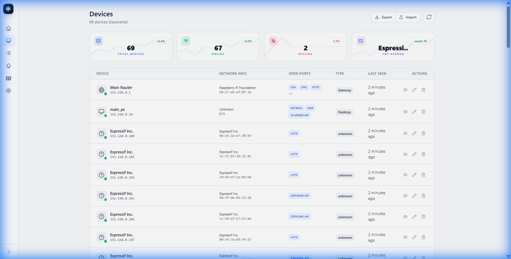
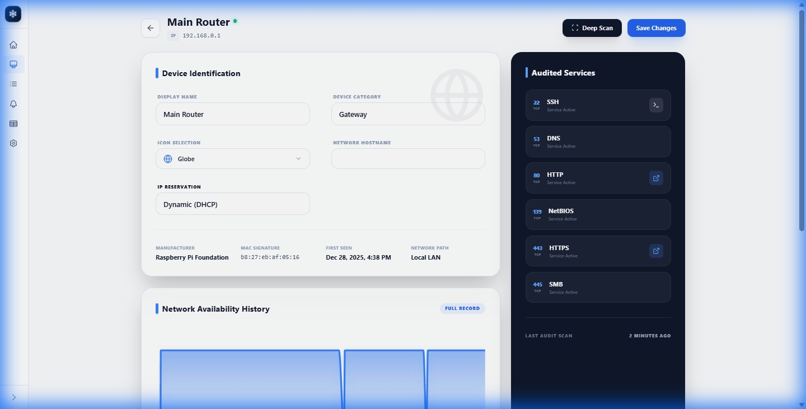
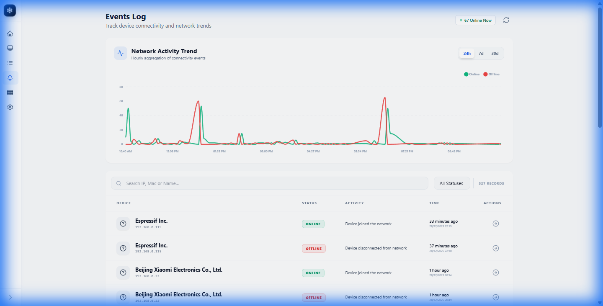

# 🛡️ Home Network Management System (HNMS)

<div align="center">

[](VERSION)
[](LICENSE)
[](Dockerfile)
[](ui/)
[](backend/)

**A professional-grade, web-based network monitoring and security suite for the modern home.**

[Explore Features](#-detailed-usage-guide) • [Quick Start](#️-quick-start-docker) • [Developer Guide](#-manual-development-setup)

</div>

---


HNMS is designed to give you total visibility over your local network. It combines real-time Nmap scanning with persistent historical tracking to provide a comprehensive security audit of every device in your home.

## 📑 Table of Contents
- [✨ Key Features](#-key-features)
- [🛠️ Tech Stack](#️-tech-stack)
- [📸 Gallery](#-gallery)
- [📘 Detailed Usage Guide](#-detailed-usage-guide)
- [🚀 Quick Start (Docker)](#️-quick-start-docker)
- [💻 Manual Development Setup](#-manual-development-setup)
- [📂 Project Structure](#-project-structure)

---

## ✨ Key Features

| Feature | Description |
| :--- | :--- |
| **Dual-Mode Discovery** | Parallel Scapy ARP + ICMP Ping sweeps for 100% device parity across Docker & Windows. |
| **Dynamic Classification** | Fully editable rules engine in the UI for custom icons and device-type matching. |
| **Analytical History** | Immutable scan logs and uptime trends with sub-second precision. |
| **Premium UX** | Modern glassmorphism design with unified notification toasts and custom modals. |
| **Rock-Solid Stability** | Shared-connection logic resolves database locking issues in high-concurrency environments. |
| **Timezone Aware** | Optimized timestamp handling with automatic UTC synchronization. |

---

## 🛠️ Tech Stack

- **Frontend**: [Vue 3](https://vuejs.org/) (Composition API), [Vite](https://vitejs.dev/), [Tailwind CSS](https://tailwindcss.com/), [Luxon](https://moment.github.io/luxon/)
- **Backend**: [FastAPI](https://fastapi.tiangolo.com/), [Uvicorn](https://www.uvicorn.org/)
- **Database**: [DuckDB](https://duckdb.org/) (High-performance analytical storage)
- **Scanning Engine**: [Nmap](https://nmap.org/), [Scapy](https://scapy.net/)
- **Integration**: [MQTT](https://mqtt.org/) (Paho), [Home Assistant Discovery](https://www.home-assistant.io/integrations/mqtt/#mqtt-discovery)

---

## 📸 Gallery

### Device Management

*Granular control over your network inventory with vendor-specific metadata.*

### Intelligent Classification

*Manage how devices are identified with customizable Regex and Port rules.*

### High-Fidelity Analytics

*Sub-second precision on device availability and deep port audit history.*

### Activity Trends

*Visualize spikes in network movement and monitor hardware stability.*

---

## 📘 Detailed Usage Guide

### 📊 Dashboard & Analytics
The Hub for your network health.
- **Sparklines**: Integrated trend lines within metric cards reveal 24-hour activity patterns.
- **Live Feed**: Pulsing activity log monitors current worker status.

### ⚙️ Rule Management
Located in **Settings**, the classification engine allows you to:
- **Prioritize Identification**: Ensure high-priority rules match before generic ones.
- **Regex Support**: Match devices by Hostname, Vendor, or common local ports.
- **Icon Selector**: Choose from a premium Lucide-based icon library.

### 🔍 Device Management
- **Audit Trigger**: Initiate manual scans to force a directory refresh.
- **Deep Audit**: Probes 1000+ ports; captures banner metadata for precise identification.

### 📡 MQTT Integration & Automation
HNMS acts as a bridge between your network and your smart home.

> [!TIP]
> Use the **Home Assistant Discovery** feature to instantly see network presence as binary sensors in your HA Dashboard.


| Topic Pattern | Description |
| :--- | :--- |
| `{base}/device/{mac}/state` | Broadcasts `home` / `not_home`. |
| `{base}/device/{mac}/attributes` | Rich JSON containing IP, Vendor, and OS details. |

---

## 🚀 Quick Start (Docker)

> [!IMPORTANT]
> For Linux deployments, use `network_mode: host` in `docker-compose.yml` to allow the scanner full access to the network interface.

```bash
docker-compose up -d
```
Access at: [http://localhost:8000](http://localhost:8000)

---

## 💻 Manual Development Setup

### Backend (FastAPI)
```bash
cd backend
pip install -r requirements.txt
python -m uvicorn app.main:app --reload --port 8001
```

### Frontend (Vue 3)
```bash
cd ui
npm install
npm run dev
```

---

## 🛠️ Windows Troubleshooting

If device discovery is not working on your Windows machine, please check the following:

### 1. Install Npcap
The scanner uses Scapy, which requires a packet capture driver on Windows. 
- Download and install **[Npcap](https://npcap.com/#download)**.
- During installation, ensure the **"Install Npcap in WinPcap API-compatible Mode"** option is checked.

### 2. Run as Administrator
Sending raw network packets (ARP) requires high-level privileges. 
- Open your terminal (PowerShell or CMD) as **Administrator** before running the uvicorn command.

### 3. Automatic Fallback
The system includes a smart fallback. If raw ARP packets are restricted by your security policy, HNMS will automatically pivot to a **Parallel Ping Sweep**. This ensures devices are found even without specialized drivers.

---

## 📂 Project Structure
- `/backend`: Analytical core and scanning workers.
- `/ui`: Modern glassmorphism interface.
- `/.img`: Optimized local asset storage.
- `publish.sh`: Automated CI/CD versioning script.

---

<div align="center">
Built with ❤️ for the Home Automation Community
</div>